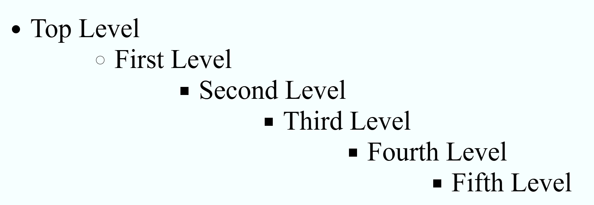
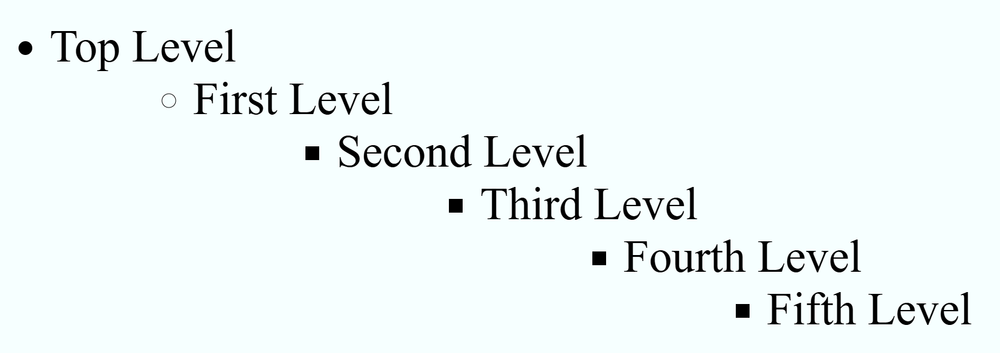
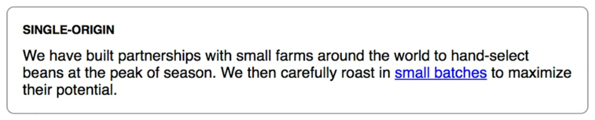
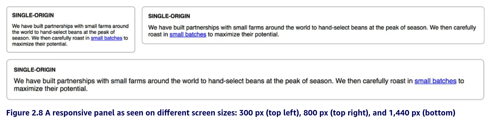
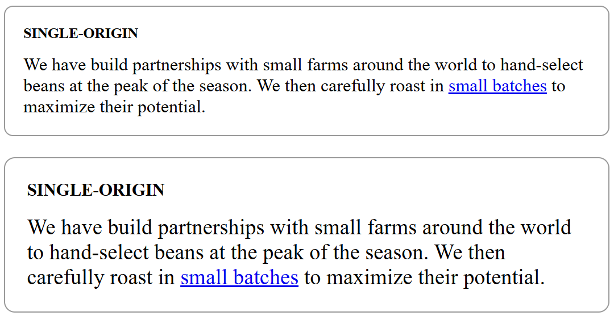
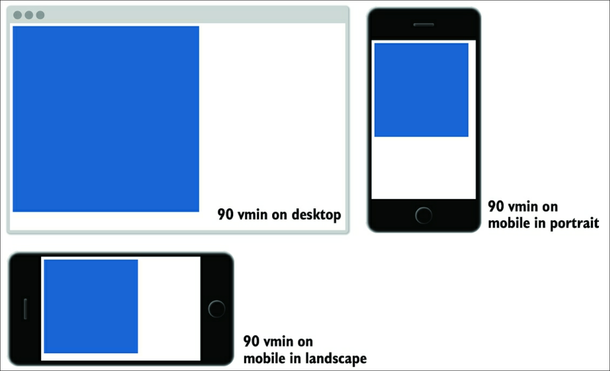

# Notes from CSS in Depth - by Keith J. Grant


<details>
<summary>Book Resources</summary>

- [Repository of book code listings](https://github.com/CSSInDepth/css-in-depth-2)
- [Can I use](https://caniuse.com/) - Check browser support for CSS features.

</details>

<!-- omit in toc -->
## Contents

- [Chapter 1: Cascade, Specificity, and Inheritance](#chapter-1-cascade-specificity-and-inheritance)
  - [CSS Specificity](#css-specificity)
  - [1.3 Special Values](#13-special-values)
  - [1.4 Shorthand Properties](#14-shorthand-properties)
  - [1.5 Progressive Enhancement](#15-progressive-enhancement)
    - [Progressively enhancing selectors](#progressively-enhancing-selectors)
    - [Feature queries using `@supports`](#feature-queries-using-supports)
- [Chapter 2: Working with Relative Units](#chapter-2-working-with-relative-units)
  - [2.1 The Power of Relative Units](#21-the-power-of-relative-units)
  - [2.2 Ems and rems](#22-ems-and-rems)
    - [2.2.1 Using ems to define font-size](#221-using-ems-to-define-font-size)
    - [Ems for font size together with other properties](#ems-for-font-size-together-with-other-properties)
    - [The shrinking font problem](#the-shrinking-font-problem)
    - [Using rems for font size](#using-rems-for-font-size)
  - [2.3 Stop thinking in pixels](#23-stop-thinking-in-pixels)
    - [2.3.1 Setting a sane default font size](#231-setting-a-sane-default-font-size)
    - [2.3.2 Making the panel responsive](#232-making-the-panel-responsive)
    - [2.3.3 Resizing a single component](#233-resizing-a-single-component)
  - [2.4 Viewport-relative Units](#24-viewport-relative-units)

## Chapter 1: Cascade, Specificity, and Inheritance

### CSS Specificity


It is generally best to keep specificity low when you can, so when you need to overrride something, your options are open.

Rules of thumb for cascading:
1. Don't use IDs in your CSS selectors.
2. Don't use `!important`.

Both of these make it harder to override styles later. IDs are very specific, and `!important` is a hammer that can break things.

### 1.3 Special Values  

Use the `inherit` keyword to force a property to inherit from its parent. This is useful when you want to override a property when a cascaded value is preventing it.

Use the `initial` keyword to set a property to its default value. This is useful when you want to have styles to undo. Every CSS property has an initial, or default, value. Assigning the `initial` keyword to a property will set it to its default value.:

Use the `unset` keyword to set a property value back to `inherit` if it is inheritable, and to `initial` if it is not. Using `unset` makes it a little simpler and helps you avoid using the wrong keyword&mdash;`inherit` or `initial`&mdash;for the property you are working with.

When using `initial` and `unset`, it is important to understand the default property values.

Use `revert` when you want to override your previously set author styles but leave the user-agent styles in place. The `initial` and `unset` keywords essentially override all styles, both from author and user-agent stylesheets.

These keywords are normal cascaded values, so it is possible to override them when another selector with higher specificity targets the same element.

See [here](./ch01/1-inheritance/styles.css) for an example usage of these keywords.

### 1.4 Shorthand Properties
- Shorthand properties enable you to set values of several properties at the same time.

```css
h1 {
  font: 16px/1.5 "Helvetica Neue", Helvetica, Arial, sans-serif;
}
```
- However, be careful with shorthand properties, as they can silently override other properties.
- Avoid using font with shorthand properties because it sets a wide array of properties that can be silently overridden.
- Some shorthand properties have ordering rules. Ordering goes from top, right, bottom, left.

```css
.nav a {
  padding: 10px 15px 0 5px;
}
```

- Specify three values, and the first value is for the top, the second value is for the right and left, and the third value is for the bottom.

```css
.nav a {
  padding: 10px 15px 5px;
}
```

- Specify two values, and the first value is for the top and bottom, and the second value is for the right and left.

```css
.nav a {
  padding: 5px 10px;
}
```

- In most cases, you'll see two values. For example buttons have a higher padding on the left and right (second value) than the top and bottom (first value).
- The top, right, bottom, left rule only applies for properties with four values.
- Other properties, such as `background-position`, have two values, and in this case the first value is for the horizontal position and the second value is for the vertical position.
- The reason for this is that two-value properties represent coordinates x and y on the Cartesian grid.

```css
.nav .featured {
  background-color: orange;
  box-shadow: 10px 2px #6f9090;
}
```
  

- If you're working with a property that specifies two meaurements from a corner, think "Cartesian grid". If you're working with a property that specifies four measurements, think "clock".

### 1.5 Progressive Enhancement
- Progressive enhancement lets you offer a basic experience for older browsers and advanced features for modern ones.
- Visit [Can I use](https://caniuse.com/) to check browser support for CSS features.
- Progressive enhancement is built into the cascade.
```css
aside {
  background-color: #333333;      /* Default for all browsers */
  background-color: #333333aa;    /* Adds semi-transparency for modern browsers */
}
```
- Older browsers ignore the second rule. Modern browsers apply the second rule.

#### Progressively enhancing selectors
- When a ruleset has multiple selectors, the browser will ignore the entire ruleset if any of the selectors are not supported.
```css
input.invalid,
input:invalid {
  border: 1px solid red;
}
```
- In this case, if the browser doesn't support `:invalid`, it will ignore the entire rule. This is a problem because the first selector is supported by all browsers.
- In this scenario, the best approach is to separate each selector into its own ruleset.
```css
input.invalid {
  border: 1px solid red; /* All browsers */
}
input:invalid {
  border: 1px solid red; /* Modern browsers */
}
```
#### Feature queries using `@supports`
- Use feature queries to specify multiple declarations for broswers that support a feature compared to those that do not.
```css
@supports(display: grid) {...}
```
- If the browser supports grid, it applies any rulesets inside the braces; otherwise, it ignores them.
```css
.coffees {
  margin: 20px 0;
}

.coffees a {
  display: inline-block;
  min-width: 300px;
  padding: 10px 15px;
  margin-right: 10px;
  margin-bottom: 10px;
  color: black;
  background-color: transparent;
  border: 1px solid gray;
  border-radius: 5px;
}

@supports (display:grid) {
  .coffees {
    display: grid;
    grid-template-columns: 1fr 1fr 1fr;
    gap: 10px;
  }
  .coffees a {
    margin: unset;
    min-width: unset;
  }
```
- The fallback and other basic styles, e.g. colors, are outside the feature query, so they'll apply in all browsers.
- See [here](./ch01/3-feature_queries/styles.css) for an example usage of feature queries.

- Feature queries may be constructed in a few other ways:
  - `@supports not (<declaration>)` - This will apply the ruleset if the browser does not support the feature.
  - `@supports (<declaration>) and (<declaration>)` - This will apply the ruleset if the browser supports both features.
  - `@supports (<declaration>) or (<declaration>)` - This will apply the ruleset if the browser supports either feature.
  - `@supports (<selector>)` - This will apply the ruleset if the browser supports the selector.


## Chapter 2: Working with Relative Units

**Length**: a formal name for a CSS value that deontes a distance measurement. 

### 2.1 The Power of Relative Units

CSS supports several absolute lengths:
- `px` - pixels
- `cm` - centimeters
- `mm` - millimeters
- `Q` - quarter millimeters
- `in` - inches
- `pt` - points (1/72 of an inch)
- `pc` - picas (1/6 of an inch)

Pixel is slightly misleading because a CSS pixel does not strictly equate to a monitor's pixel. This is notably in the case of high-DPI displays, where a CSS pixel is larger than a monitor pixel. This is because the browser scales the CSS pixel to fit the display.

**Responsive design**: refers to styles that "respond" differently based on the size of the browser window. This is typically done using relative units, such as percentages, `em`, and `rem`.

### 2.2 Ems and rems

*Ems*, the most common relative unit, are measured in typography, referring to a specific font size.
```css
.padded {
  font-size: 16px;
  padding: 1em; /* 16px */
}
.padded {
  font-size: 16px;
  padding: 2em; /* 32px */
}
```
  - 1 em means the font size of the current element; it's exact value varies depending on the element you're applying it to.
  - IMPORTANT: Values declared using relative units are evaluated by the browser to an absolute value, called the **computed value**. 
  - Using ems are convenient when setting properties like padding, height, or border-radius, because these scale evenly with the element if it inherits different font sizes or if the user changes font settings.

A powerful feature of ems allows you to define the size of an element and then scale the entire thing up or down with a single declaration that changes the font size:

```css
.box {
  padding: 1em;
  border-radius: 1em;
  background-color: lightgray;
}

.box-small {
  font-size: 12px;
}

.box-large {
  font-size: 18px;   /* Changes the size of the entire box */
}
```


#### 2.2.1 Using ems to define font-size

With regard to ems, the font-size property is a special case. Since an ems is defined by the current element's font size, the font-size property is derived from the inherited font size.

```css
body {
  font-size: 16px;
}

.slogan {
  font-size: 1.2em; /* Calculated size: 1.2 * 16px = 19.2px */
}
```


> For most browsers, the default font size is 16px. This means that 1em is equal to 16px.

#### Ems for font size together with other properties

What makes ems tricky is when you use them for font size together with other properties. When you do this, the browser calculates the font size first, and then it uses that value to calculate the other values.

Both properties can have the same declared value but different computed values:

```css
body {
  font-size: 16px;
}

.slogan {
  font-size: 1.2em;       /* 1.2 * 16px = 19.2px */
  padding: 1.2em;         /* 1.2 * 19.2px = 23.04px */
  background-color: #ccc;
}
```


#### The shrinking font problem

Ems can produce unexpected results when you use them to specify the font sizes of multiple nested elements.

```css
body {
  font-size: 16px;
}

ul {
  font-size: 0.8em;
}
```


Each list has a font size of 0.8em, which is 80% of the font size of the parent element.

**Possible Solution:** Target all unordered lists within an unordered list and set the font size to 1em. This will make the font size of the nested list equal to the font size of the parent list.

```css
body {
  font-size: 16px;
}

ul {
  font-size: 0.8em;
}

ul ul {
  font-size: 1em;   /* targets only nested lists */
}
```


This solution works, but it is not ideal because you're setting a value and then overriding it with another rule. The better option is to use *rems*.

#### Using rems for font size

In the Document Object Model (DOM), the <html> element is the root node. The root node has a special pseudo-class selectors called `:root` that you can use:

Rem is short for "root em". Instead of being relative to the current element, rems are relative to the root element. This means that rems are not affected by the font size of the parent element.

```css
:root {               /* This pseudo-class selector targets the <html> element */
  font-size: 1em;
}

ul {
  font-size: 0.8rem;  /* Uses the browser's default font size of 16px */
}
```


> Author's recommendation: Use rems for font sizes, pixels for borders, and ems or rems for most other measures, especially paddings, margins, and border-radius.

### 2.3 Stop thinking in pixels

The following pattern is a common antipattern in CSS:

```css
html {
  font-size: 0.625em;   /* Scales browser's default font size of 16px to 10px, making it easier to simplify math */
}
```
The author does not recommend this approach because (1) it forces you to write a lot of duplicate styles, and (2) you might type 1.6 rem into your code, but in your mind, you're thinking 16px. 

Instead, the author recommends you geting in the habit of using ems first.

#### 2.3.1 Setting a sane default font size

The following code sets a default font size of 14px. This value must be obtained by dividing by the browser's default font size of 16px (14px / 16px = 0.875em):

```css
:root {                   /* Target the HTML selector */
  font-size: 0.875em;     /* 14/16 (desired px / inherited px) equals 0.875em */
}
```
**Goal:** Build a panel like below using relative units and an inherited font size:  


The markup: 

```html
<div class="panel">
  <h2>Single-origin</h2>
  <div class="panel-body">
    We have build partnerships with small farms around the world to
    hand-select beans at the peak of the season. We then carefully roast
    in <a href="/batch-size">small batches</a> to maximize their potential.
  </div>
</div
```
The CSS:

```css
:root{
  font-size: 0.875em; /* 14px */
}

.panel { 
  padding: 1em;
  border-radius: 0.5em;
  border: 1px solid #999; /* Puts a thin border around the element. #999 is shorthand for #999999 */
}

.panel > h2 { /* Descendant combinator applies styles to all h2 elements inside .panel */
  margin-top: 0;
  font-size: 0.8rem;
  font-weight: bold;
  text-transform: uppercase;
}
```

#### 2.3.2 Making the panel responsive

Using media queries to change the base font size, depending on the screen size. A media query uses an `@media` rule to specify styles that will be applied only to certain screen sizes or media types.

Goal:  


```css
:root{
  font-size: 0.85em; /* 1em = 16px, so 0.85em = 13.6px */
}

/* Applies only to screens 800px and wider, overriding the original value */
@media (min-width: 800px) {
  :root {
    font-size: 1em; /* 1em = 16px */
  }
}

/* Applies only to screens 1200px and wider, overriding both values original  */
@media (min-width: 1200px) {
  :root {
    font-size: 1.15em; /* 1.15em = 18.4px */
  }
}


.panel {
  padding: 1em;
  border-radius: 0.5em;
  border: 1px solid #999;
}

.panel > h2 { /* Descendant combinator applies styles to all h2 elements inside .panel */
  margin-top: 0;
  font-size: 0.8rem;
  font-weight: bold;
  text-transform: uppercase;
}
```
These two media queries can eliminate the need for dozens of media queries throughout the rest of your CSS. But it doesn't work if you define your values in pixels: you need to use relative units. 

#### 2.3.3 Resizing a single component

You can use ems to scale an individual component on the page. You can do this by using relative units. However, in this case, you're adjusting what the units are relative to. With this approach, the only thing you have to do is override the parent element's rem font size to scale the entire component: 

```css
.panel {
  font-size: 1.0rem;    /* Establishes a predictable font size for the panel */
  padding: 1em;
  border: 1px solid #999;
  border-radius: 0.5em;
}

.panel > h2 {
  margin-top: 0;
  font-size: 0.8em;   /* Uses ems to make other fonts relative to the established parent font size */
  font-weight: bold;
  text-transform: uppercase;
}

.panel.large {      /* Compound selector (no space between) targets elements with both .panel and .large classes */
  font-size: 1.2rem;
}
```
**Note:** It only takes one declaration to resize the entire component.

```html
<div class="panel">
  <h2>Single-origin</h2>
  <div class="panel-body">
    We have build partnerships with small farms around the world to
    hand-select beans at the peak of the season. We then carefully roast
    in <a href="/batch-size">small batches</a> to maximize their potential.
  </div>
</div>

<br />

<div class="panel large">   <!-- Add the large class to scale the component -->
  <h2>Single-origin</h2>
  <div class="panel-body">
    We have build partnerships with small farms around the world to
    hand-select beans at the peak of the season. We then carefully roast
    in <a href="/batch-size">small batches</a> to maximize their potential.
  </div>
</div
```


### 2.4 Viewport-relative Units

While ems and rems are relative to the font size, viewport-relative units are relative to the browser's viewwport.

The viewport is a framed aread in the browser window where the web page is visible. This excludes the browser's address bar, toolbars, and other UI elements.

There are at least 24 viewport-relative units in CSS. Here are the four basice ones:
- vh - One percent of viewport height
- vw - One percent of viewport width
- vmin - One percent of the smaller dimension, height or width
- vmax - One percent of the larger dimension, height or width

**Example:** 50vw is equal to half the width of the viewport, and 25vh equals 25% of the viewport's height.

The following example shows a square element that is defined with both a height and width of 90vmin, which equals 90% of the smaller of two dimensions&mdash;90% of the height on landscape screens or 90% of the width on portrait screens


